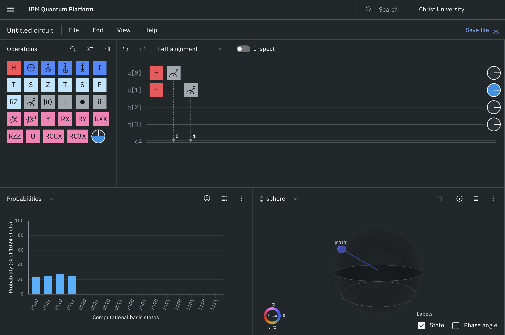

# Quantum Random Number Generator

This project demonstrates how quantum computing generates true randomness using qubits.

## 🧠 Concept
In classical computing, randomness is simulated.  
In quantum computing, randomness is inherent due to superposition.

## ⚙️ How it works
- Initialize qubits in state |0⟩
- Apply Hadamard (H) gate → creates superposition
- Measure qubits → collapses to random values

## 🔢 Output
Using 2 qubits, possible outputs:
- 00 → 0
- 01 → 1
- 10 → 2
- 11 → 3

Each occurs with ~25% probability.

## 💻 Code
```python
qc.h(0)
qc.h(1)
qc.measure([0,1], [0,1])

## 📸 Circuit and Output

The circuit below demonstrates superposition using Hadamard gates on two qubits, producing uniform randomness.


